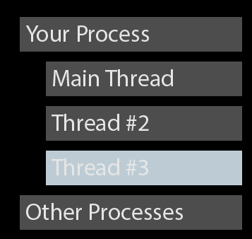
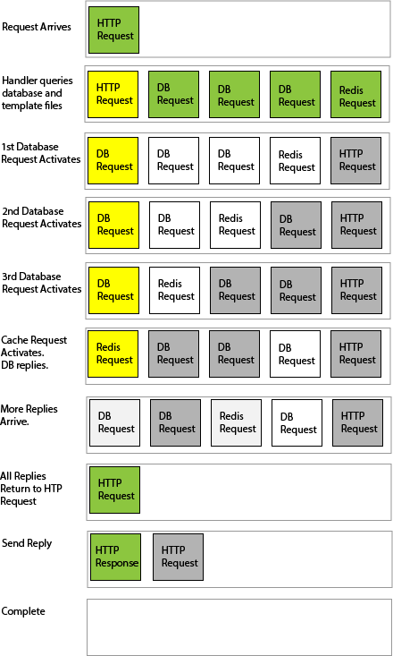

# Concurrency & Parallelism

You perform tasks in *parallel* at the same time. One task per CPU core.

**System Threads** are the basic form of parallelism---and will spread across how ever many cores you have. Threads are pretty clever:

* Threads are preempted by the Operating System scheduler.
* When preempted, state is saved---right down to registers. It can even happen mid-instruction!
* Another thread has its state restored and executes.
* The OS scheduler will switch between threads, and even between processes.
* The OS scheduler will spread threads across cores.

Threads are relatively heavy-weight. You can't have thousands of them, and there's overhead to creating and destroying them.

---

You perform tasks *concurrently* when you have a lot of tasks, and can switch between them. You can *concurrently* serve a number of clients, even on a single thread.

**Coroutines** (aka green threads and async/await) are a great form of concurrency. `Node.js` showed that you can make a high-performance server with only one thread.

> If you remember Macs pre-OS X or old Amigas, they multi-tasked cooperatively. Coroutines work the same way: a task runs until it yields or waits for something else.
